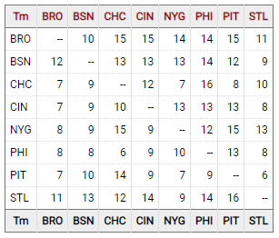

# Sports Reference Engineering Internship Prompt

The following is a solution to the Sports Reference Engineering Internship Prompt done in JavaScript. You can view a demo at this link: https://ameer-ahmad.github.io/SR-Eng-Intern-Prompt/

Given a json file that includes each team's Win-Loss records versus opponents, this program builds an HTML table that displays a matrix of head-to-head records.

# Solution

I decided to loop through the teams twice, the first loop being the team on the left hand side of the table, and the second loop being the team on the top of the table. Then I displayed the winning record of the first team.

# Screenshots

